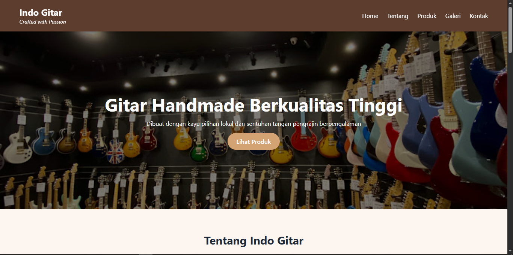
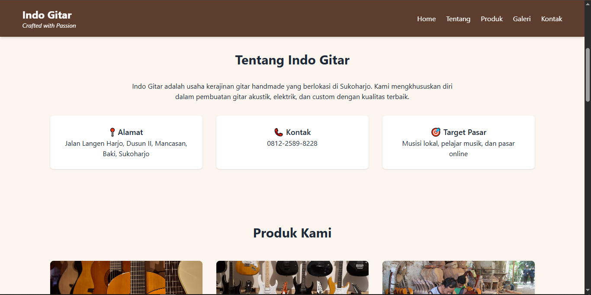
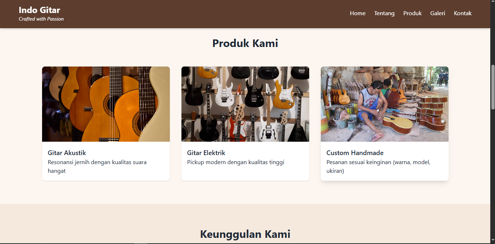
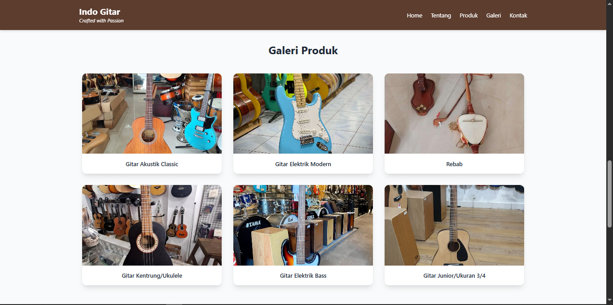

# 🎸 Indo Gitar – Website UMKM Pengrajin Gitar Handmade

Website promosi sederhana untuk **UMKM Indo Gitar**, pengrajin gitar handmade asal Sukoharjo, Jawa Tengah.  
Dibuat menggunakan **HTML5 dan Tailwind CSS** sebagai bagian dari tugas proyek Front-End D3 Teknik Informatika Universitas Sebelas Maret (UNS).

---

## 🌟 Fitur Utama
- **Desain Responsif** – Tampilan menyesuaikan ukuran layar (HP, tablet, laptop)
- **Navigasi Lengkap** – Home, Tentang, Produk, Galeri, dan Kontak
- **Hero Section Menarik** – Gambar background gitar handmade dengan tombol CTA
- **Katalog Produk** – Menampilkan gitar akustik, elektrik, hingga custom handmade
- **Formulir Kontak** – Pengunjung bisa mengirim pesan atau permintaan custom
- **Tema Coklat Elegan** – Terinspirasi dari warna kayu gitar alami

---

## 🧰 Teknologi yang Digunakan
- **HTML5**  
- **Tailwind CSS (via CDN)**  
- **Responsive Grid & Flexbox Layout**  
- **Font Sans-Serif Modern**

---

## 📂 Struktur Folder
/project
├── index.html
├── /img
│ ├── gitarr.jpg
│ ├── gitar-elektrik2.jpg
│ ├── pengrajin_gitar.jpg
│ ├── gitar-akustik1.jpg
│ ├── gitar-elektrik3.jpg
│ ├── rebab.jpg
│ ├── kentrung.jpg
│ ├── bass-custom.jpg
│ └── gitar_junior.jpg

## 🚀 Cara Menjalankan Website
1. Clone repository ini:
   ```bash
   git clone https://github.com/Yogiexc/Basic_Front-end.git
Buka folder hasil clone:

bash
Copy code
cd Basic_Front-end
Jalankan file index.html di browser favoritmu (Chrome, Edge, Firefox, dll).

🖼️ Preview Website




👨‍💻 Pengembang
Bryan Yogie Saputra
🎓 D3 Teknik Informatika – Universitas Sebelas Maret
📍 Sukoharjo, Jawa Tengah
📱 0812-2589-8228
